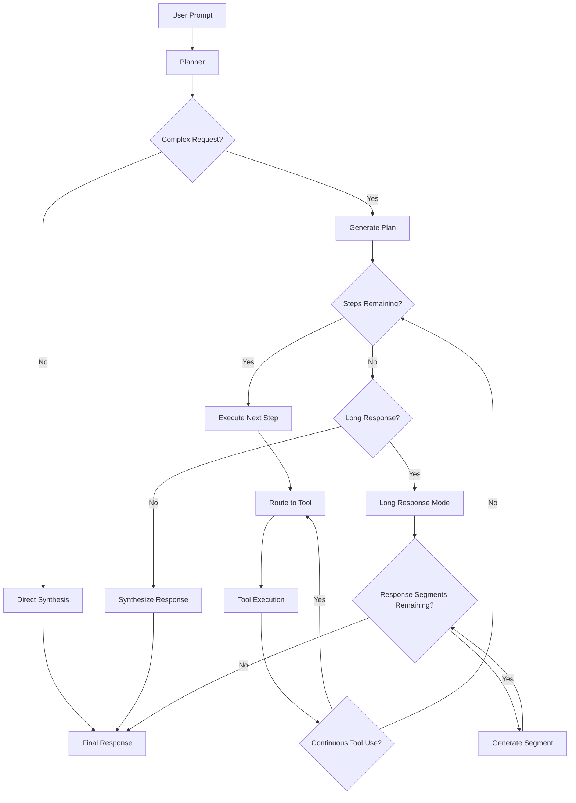

# Project Write Up

> **Note:** This is going to be kind of informal since I don't really know how to write project write ups...

## Introduction

This project, called Thinking Without Thinking (TWT) is a project that attempts to do two things:

1. Create an informal "system 2 thinking" pipeline (like o1, o3, and R1) using prompt engineering and small models (~sub 40B)
2. Optimize the prompt engineering to see if small models can outperform baseline large models with such good prompting and a pipeline

**Hypothesis:** small models can somewhat match large model performance through pipeline structure and prompt engineering.

**Inspiration:** The inspiration for this project came from some random guy I saw at my school back when 3.5 was still a new thing using prompt engineering. I remembered that image randomly recently and thought I might try to formalize it, hence TWT became a thing.

## Part 1: System 2 Thinking

The first part of the project, system 2 thinking (see src/pipeline.py and src/pipeline_blocks.py for the core architecture) was made to mimic how an actual human would generate a response to a difficult questions. 

Normally, we would make a plan, collect evidence, and then synthesize them into a response (like an APUSH DBQ essay). Thus, I tried to formalize this by creating modular pipeline blocks. 

There are three general types of pipeline blocks, each with unique prompting:

1. General blocks*: these are general, non-specialized blocks
2. Router blocks*: these decide which blocks will be used in a given pipeline
3. Tool blocks*: these collect information to be synthesized 

(* represents whether or not a block's prompting is dynamic or not)

The blocks are organized around a parent PipelineBlock class which stores all the metadata and generic process functions to allow for the best possible modularity.

Each block follows a strict pydandic json schema outline

### General Blocks

There are a couple of blocks in this category:

1. Planner Block: makes plans to follow with concrete steps
2. Subplan Block: makes subplans for each step of the primary planner depending on if the request is complex enough
3. Synthesis Block: synthesizes information together into a response
4. Self-critique Block: critiques an inputted item
5. Improvement Block: improves a given item based on the self-critique

These serves as the primary "textual" response blocks

### Router Blocks

There are also a couple of blocks in this category:

1. Primary Router Block: first router to the tools
2. Secondary Router Block: routes if the the primary router block determines that the tool output needs to be inputted back into the router to route to other tools with the new info in mind
3. Long Response Router Block: in case the synthesis won't fit in one message, Long-Response Router Block splits the final response up to be synthesized part by pat

### Tool Blocks

There are a couple of tool blocks:

1. Python exec tool
2. Creative idea generation tool
3. Deductive reasoning tool
4. Wikipedia search tool
5. Web search tool

### Pipeline:

The pipeline orchestrator comes down to this (mermaid chart since it's a tad bit difficult to explain in words): 

Self-improvement of the plan / single-run synthesis also occurs depending on the thinking level.

## Part 2: Prompt-self optimization

This is where stuff gets a bit more interesting:

Essentially, I took the idea of A/B testing and semi-applied it to prompt engineering (I took inspiration from those LLM benchmark websites for this one).

However, there are a few uniquenesses to this system. 

Essentially, the training goes as such:

1. Pipeline using baseline prompts (Version B from now on) solve a suite of `N` difficult problems (to prevent overfitting) from a problem set with given answers.
2. Version B is graded by an LLM on the following criteria: Prompt alignment, factuality, clarity, helpfulness, safety, tool usage, format quality, engagement, and citation quality.
3. RCA is run by an LLM to locate a list of core issues.
4. Version B prompts are and root causes are fed into LLM to generate candidate prompts (Version C).
5. Version C prompts are each checked for complience with prompt generation criteria specified in metadata. If they pass, they are adopted into Version C, if not, they are rejected.
6. Version C is run on the same `N` difficult prompts and graded again.
7. Grades, runtime, stability, and degredation are compared to determine the best version, the best version stays.
8. Repeats for `Z` epochs, the `N` problems are randomly chosen from a variety of different problems (to prevent overfitting part 2).
9. Every `T` epochs, a generalization check is run on all the prompts to make sure they aren't just including the answers / optimizing for specific questsions.

This skips over a bunch of safety and parsing stuff, but it covers the core of the system.

The theory behind this is that: more moving components (pipeline blocks) = more nuance and more adjustability, and prompt optimization capitalizes on that.

## Issues

Currently, there are a few issues, some small scale, some large scale:

1. **Inherent biases:** This, though it may try, can't get rid of inherent biases in LLMs, though it can somewhat mitigate them.
2. **Benchmarking:** I still haven't figured out benchmarking yet, so this is as of right now still untested officially.
3. **Cost:** This is expensive. I'm running it for free right now because the entire system is carried by nemotron, which has a 40 rpm limit and nothing else, but its not scalable, and my ideal vision of having a large model be the judge, RCA, and prompt rewriter is impossible due to token limits.
4. **Diminishing Returns:** There is probably a limit as to how good this can get. I haven't hit it yet, mostly because the grader is very, very harsh and the questions are pretty difficult.

There are a few more I likely didn't think of, but those are the big ones going into the future.

## Future Direction

I'm going to be honest, I'm not particularily sure where to take the project next, I'll have to let it marinate for a few more weeks to think of something, but I think its a very interesting research direction, especially if we can figure out how to do token-level probability hacking for optimal results, something of which I think would be very cool on an inference level rather than a model level.

(Actually this is a really good idea lol why didn't I think of this earlier)

## Conclusion

This is going to be a rather lazy conclusion, but in my opinion, what makes this system interesting is that it combines two things: more moving components and prompt optimization. 

I think it does have some potential to bring small models up to the quality of larger models, but the kinks in training logic still need to be ironed out for it to really work properly.
